# Portafolio de proyectos
Este repositorio contiene el Proyecto en PHP8, Ubuntu 22, MySQL 8, Apache2, Docker,  que permite gestionar proyectos.

## Tabla de contenidos
- [Documentación](#documentación)
- [Instalación en Linux](#instalación-en-linux)

## Documentación

Necesidad 1 de 3: Se requiere un sitio web que funcione como portafolio de proyectos, es
decir, donde se pueda observar una lista de proyectos, su descripción y algunas
propiedades del mismo como "Project Manager encargado", "Desarrolladores
involucrados", etc. (se pueden incluir tantas propiedades como se desee). 

 

    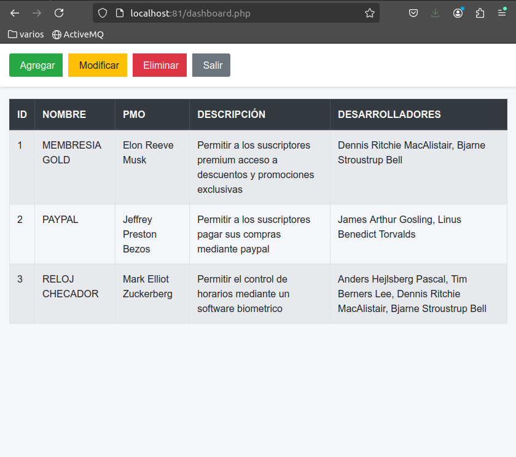
  

  
Necesidad 2 de 3: El sitio web requiere dos usuarios, uno del tipo "administrador" que
pueda ver, modificar, agregar y borrar algún proyecto del listado y uno del tipo "visor" que
pueda ver el listado de proyectos y, mediante un enlace, ver los detalles de cada uno.

    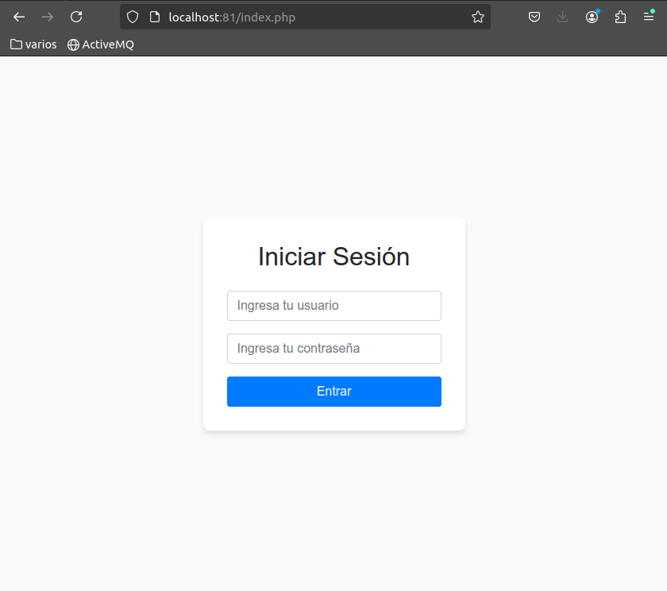
  

  Usuario: admin, Pass: 1111, apiKey = 111111AAAAAA999999ZZZZZZ
  

    
  

  Usuario: anonimo, Pass: 2222, apiKey = 2222222UUUUUU4444449PPPPPP
  

    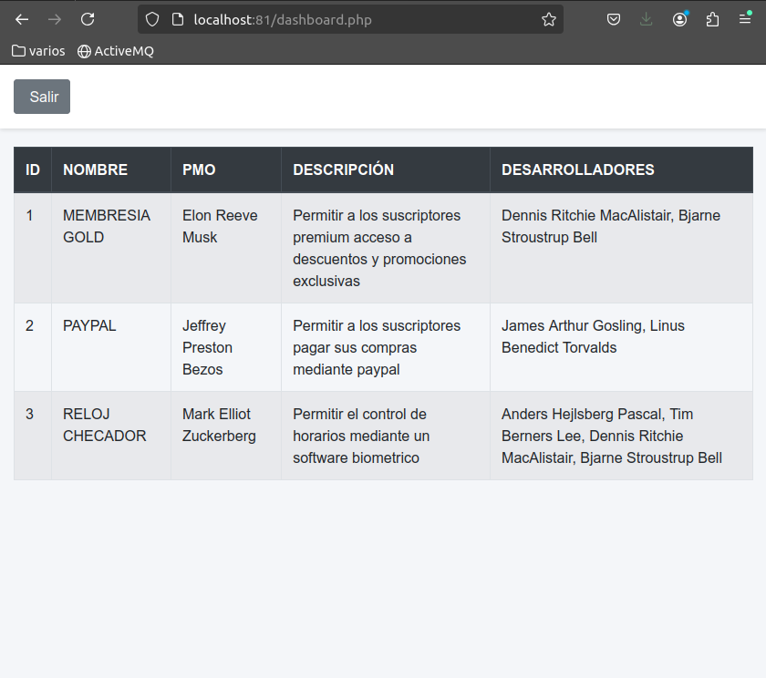
  

Necesidad 3 de 3: Se requiere exponer un servicio REST que proporcione un listado de
todos los proyectos presentes en la base de datos con un enlace que no requiera
autenticación y otro que si;

Servicio REST sin autenticación: GET  http://localhost:81/api/open/proyecto.php
 

    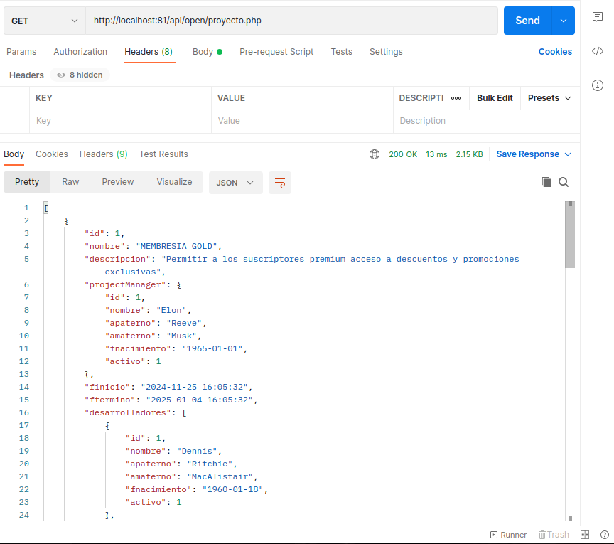
  

 Servicio REST con autenticación: GET http://localhost:81/api/auth/proyecto.php
 
 Usuario: admin, Pass: 1111, apiKey = 111111AAAAAA999999ZZZZZZ
 
 Usuario: anonimo, Pass: 2222, apiKey = 2222222UUUUUU4444449PPPPPP
 
 

    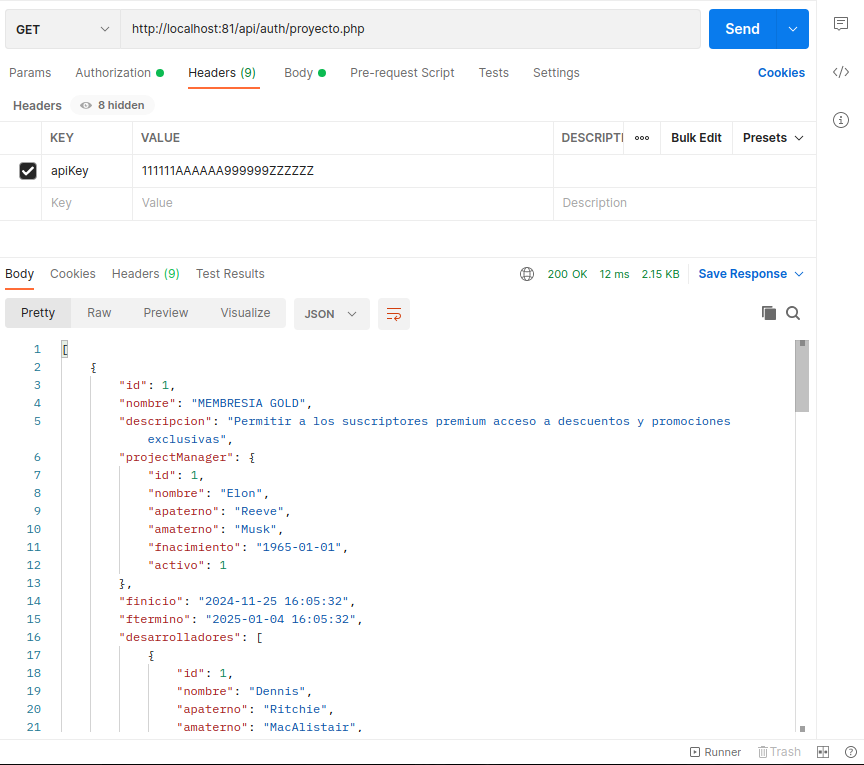
  
 

El script de la base de datos se encuentra en la raiz del proyecto clonado y se llama backup.sql

El codigo fuente del proyecto se encuentra en: portafolio_de_proyectos/sitio/www

El diagrama ER de la base de datos es:

    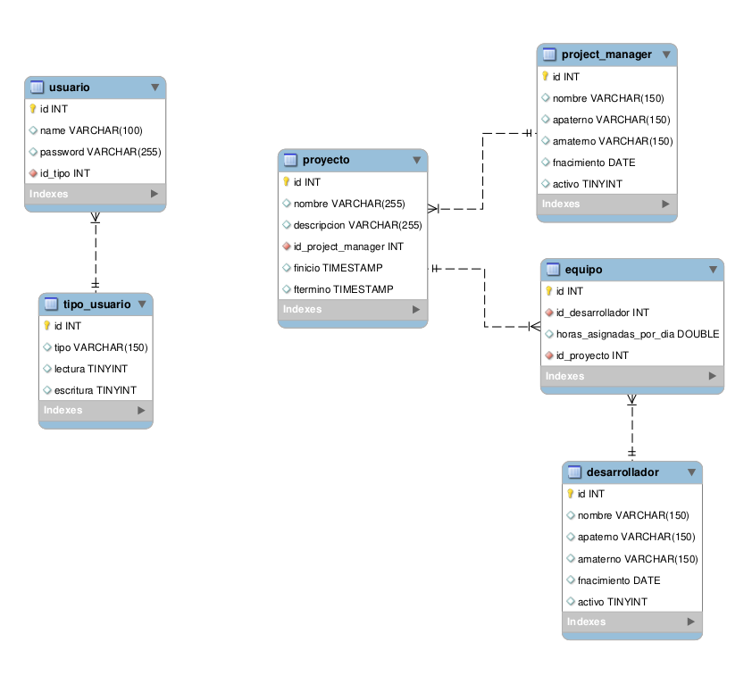
  
 

Se utilizo el patron DAO y facade en la solucion del problema, se anexa diagrama:

    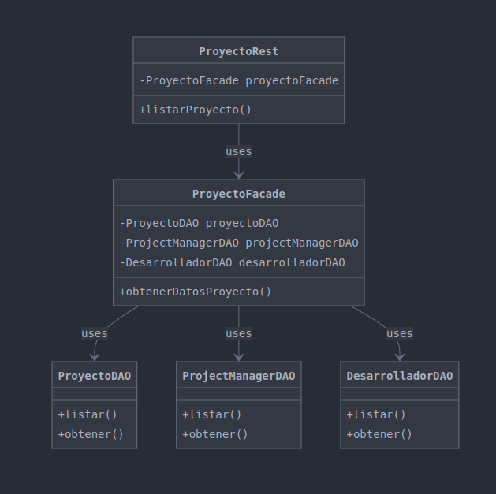
  
 

El dominio fue implementado en POJOS con php siguiendo el siguiente diagrama de clases:

    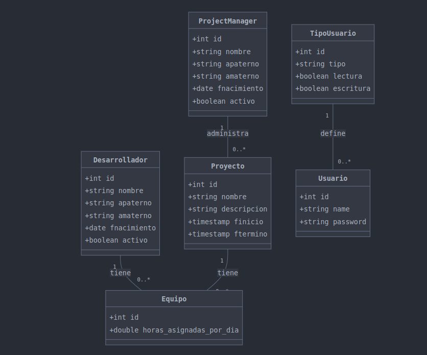
  
 

## Instalación en Linux
1) Clonar el repositorio dentro de tu carpeta personal, se recomienda esta uvicación para que puedas evitarte temas de permisos, algo asi como en: /home/paco, abre una terminal y ejecuta:
   cd ~
   pwd
   git clone https://github.com/fulanodetaldeveloper/portafolio_de_proyectos.git
   cd portafolio_de_proyectos
   
2) Abre DockerDesktop de preferencia
 
3) Da permisos de ejecución al archivo make.sh
   chmod +x make.sh
   
4) Ejecuta el script make.sh, este scrip realiza todas las tareas necesaria para crear la imagen y levantar la instancia en Docker, se apoya de un archivo Dockerfile que encontraras en la raiz del proyecto que acabas de clonar
   ./make.sh

   

    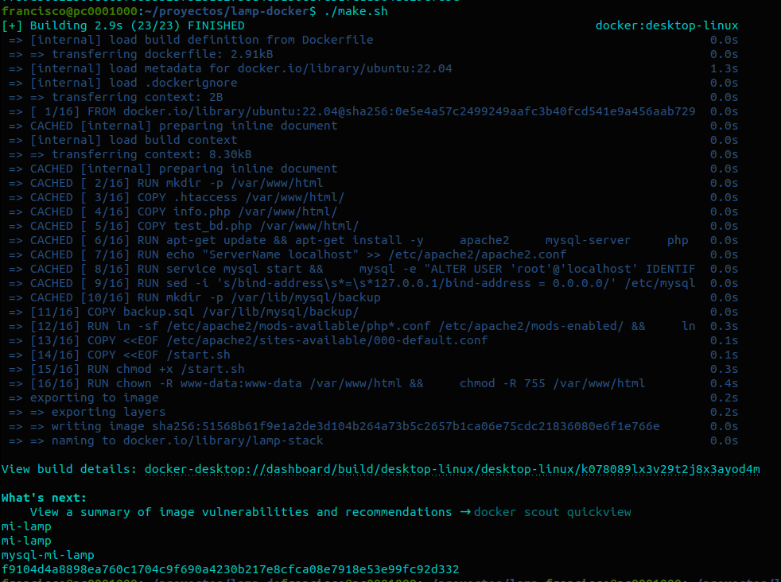
  

   
6) Estructura del proyecto portafolio
   

    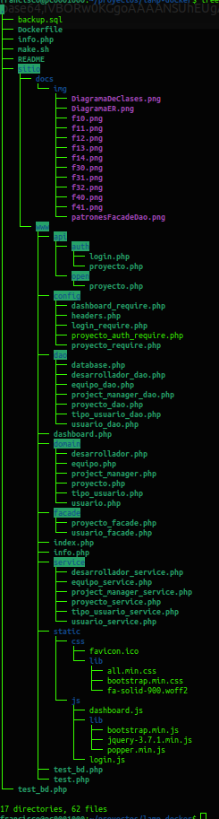
  

   

    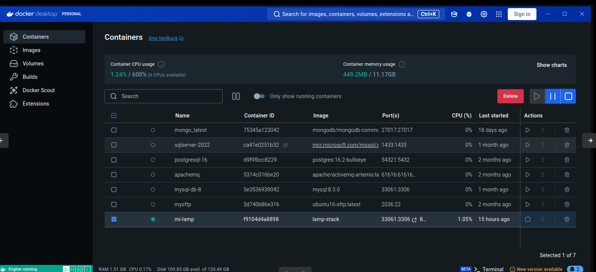
  

  

    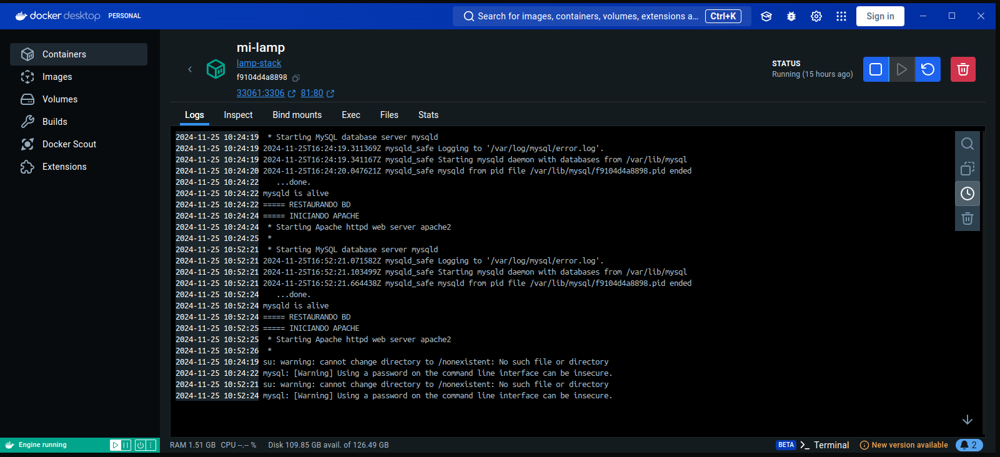
  

  

    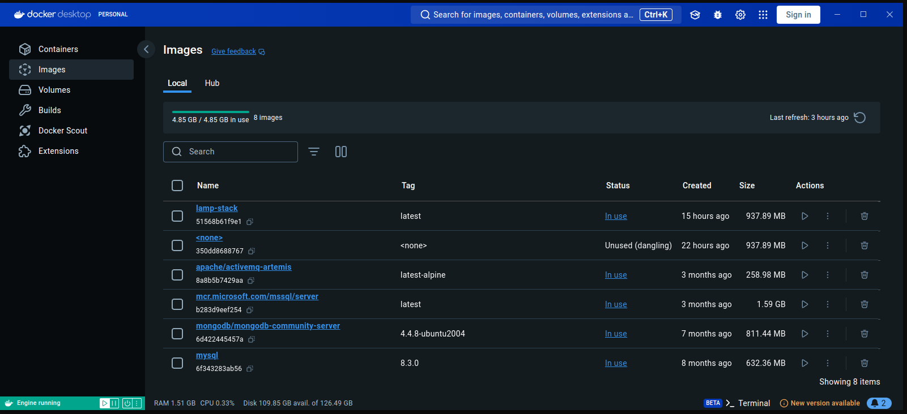
  

  

    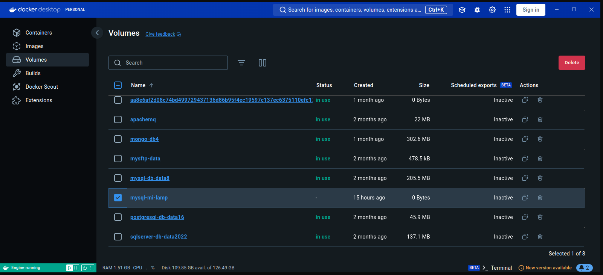
  

